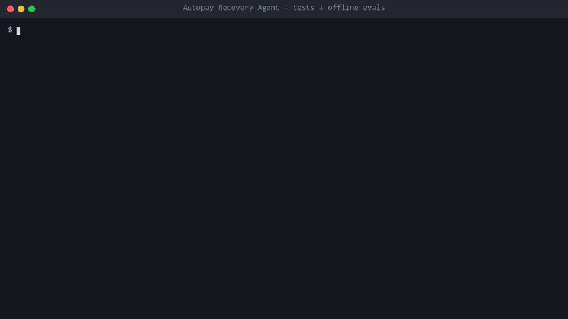
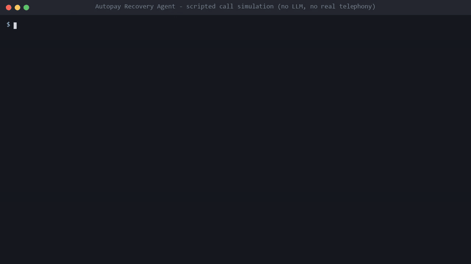
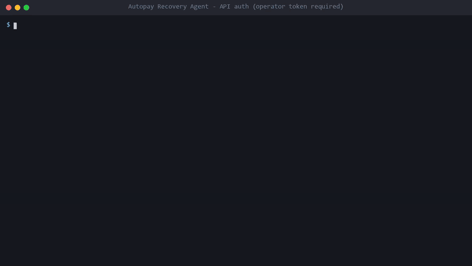
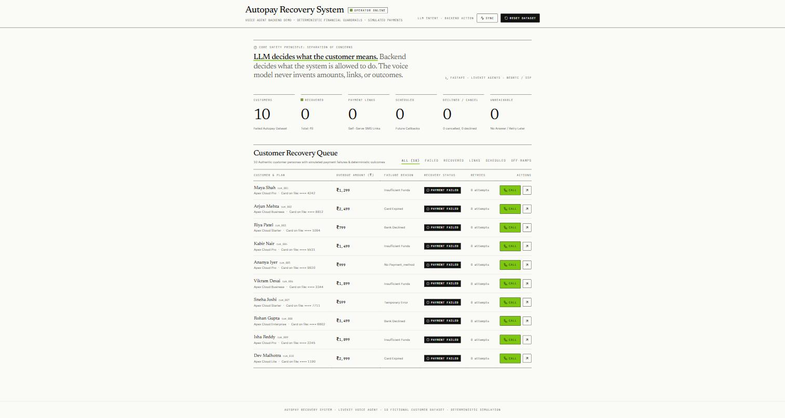

# Autopay Recovery Voice Agent

A portfolio project about one design rule for AI agents that touch money: **the LLM interprets, the backend authorizes.** A FastAPI backend owns every fact and every permission (identity, retry limits, locks, outcomes). A voice agent is only allowed to call narrow, call-bound tools on it.

## What this is, and what it is not

| Piece | State |
|---|---|
| Backend API: auth, identity challenge, guards, outcome derivation, audit events | Implemented and tested |
| Payments | **Simulated.** `backend/payments.py` is a deterministic fake. No money moves, no gateway is called |
| Text harness and CLI simulation (`agent/text_harness.py`, `agent/simulate_call.py`) | Implemented. They drive the backend logic without an LLM |
| LiveKit voice agent worker (`agent/agent.py`) | Written, **not run end to end**. Needs LiveKit and model keys. Nothing in this repo dispatches it to a room |
| Browser audio | **Not wired.** The dashboard has no LiveKit client. "Create Call Session" only creates a call record |
| Outbound SIP / phone calls | **Not implemented.** `mode=sip` returns 403 without a trunk id and 501 with one |
| Operator dashboard (Next.js) | Works against the backend (type-checked; `npm run build` not run in this audit) |
| Live LLM behaviour | Measured once on 2026-10-06 against Gemini (12/12 adversarial scenarios), *before* the identity and auth changes below. Not re-run. Needs `GEMINI_API_KEY` |

In short: it is a simulated backend with a hardened control plane, plus a text harness. The voice layer is a design and an untested worker.

## Architecture

```
 Customer voice --> STT / LLM / TTS (providers) --> agent worker --HTTP + INTERNAL token--> /internal/calls/{call_id}/*
 Operator browser (Next.js) ---------------------HTTP + OPERATOR token------------------>  /api/*
                                                                                              |
                                                                           FastAPI -> SQLite (customers, payments, calls, call_events)
```

- Agent tools never take a customer id. The backend derives the customer from the call row. The worker learns the customer name from `GET /internal/calls/{id}` and ignores participant metadata.
- Money is stored as integer paise.
- Guard order for payment actions: `CALL_LOCKED`, `CALL_FINALIZED`, `IDENTITY_NOT_VERIFIED`, `NOT_RETRYABLE`, `RETRY_LIMIT_REACHED`.
- The call outcome is derived by the backend from recorded events (`finalize`), never set by the model.

## Controls: implemented vs not

Implemented, each with tests (details in [`docs/threat-model.md`](docs/threat-model.md)):

- Separate operator and internal bearer tokens, compared with `hmac.compare_digest`; no default tokens; unset token rejects everything; `POST /api/customers/reset` requires the operator token.
- CORS allow-list (`CORS_ALLOWED_ORIGINS`), no wildcard, no credentials.
- Strict request schemas: `intent` and identity `result` are enums, `scheduled_time` must be a future ISO datetime within 90 days, field lengths capped, unknown fields rejected.
- Backend-verified identity: the customer's answer (last 4 digits of the card on file) is compared with seed data; 3 attempts, then the call locks. A free-form "verified" string is rejected.
- One-way locks: wrong person, cancel, decline and identity lock-out cannot be undone within a call.
- Idempotent retry, retry cap of 2 per customer, retry blocked for expired-card or missing-payment-method customers.
- Sensitive-data scan on transcript text sent to the backend (regex, detection only, raw text never stored, flagged on `finalize`).
- Tests and offline evals run on a throwaway SQLite file and never touch `data/app.db`.

Not implemented:

- Calling-hours / time-of-day limits, do-not-call or consent checks, call-frequency caps.
- AI-disclosure enforcement in code (it is a sentence in the prompt and the greeting).
- Recording consent, retention, deletion, data-subject-rights handling, encryption at rest.
- Rate limiting, TLS, secret rotation, per-operator identities or roles.
- Output filtering of what the LLM says; protection against a model speaking wrong facts.
- Real payment authentication, real payment links, real SMS.

**Regulatory framing.** The design targets are India's RBI fair-practices expectations for recovery calls and the DPDP Act 2023. They are targets only: this project is not compliant with, certified for, or legally reviewed against either. The earlier README claim of "TCPA / FDCPA / RBI compliance-by-design with time-of-day controls" was unsupported (TCPA and FDCPA are US laws, and no time-of-day control exists) and has been removed.

## Fictional customers (`data/customers.json`)

The identity challenge answer for each call is the `card_last4` below (fake data).

| ID | Name | Amount due | Plan | Failure reason | Card last 4 | Simulated retry outcome |
|---|---|---|---|---|---|---|
| `cus_001` | Maya Shah | Rs 1,299 | Apex Cloud Pro | insufficient_funds | `4242` | `SUCCESS_ON_RETRY` |
| `cus_002` | Arjun Mehta | Rs 2,499 | Apex Cloud Business | card_expired | `8812` | `CARD_EXPIRED` |
| `cus_003` | Riya Patel | Rs 799 | Apex Cloud Starter | bank_declined | `1094` | `BANK_DECLINED` |
| `cus_004` | Kabir Nair | Rs 1,499 | Apex Cloud Pro | insufficient_funds | `5531` | `SUCCESS_ON_RETRY` |
| `cus_005` | Ananya Iyer | Rs 999 | Apex Cloud Pro | no_payment_method | `9920` | `NEEDS_PAYMENT_METHOD` |
| `cus_006` | Vikram Desai | Rs 1,899 | Apex Cloud Business | insufficient_funds | `3344` | `FAIL_THEN_SUCCEED` (second retry succeeds) |
| `cus_007` | Sneha Joshi | Rs 599 | Apex Cloud Starter | temporary_error | `7711` | `SUCCESS_ON_RETRY` |
| `cus_008` | Rohan Gupta | Rs 3,499 | Apex Cloud Enterprise | bank_declined | `6602` | `BANK_DECLINED` |
| `cus_009` | Isha Reddy | Rs 1,099 | Apex Cloud Pro | insufficient_funds | `2245` | `SUCCESS_ON_RETRY` |
| `cus_010` | Dev Malhotra | Rs 2,999 | Apex Cloud Lite | card_expired | `1190` | `CARD_EXPIRED` |

## Call lifecycle and outcomes

Live HTTP path: an operator creates a call (`customer.status = in_progress`), the agent (or a test) answers the identity challenge, then uses the payment tools; `finalize` derives one outcome and syncs the customer record.

| Outcome (derived on `finalize`) | When |
|---|---|
| `RECOVERED` | customer status is recovered (a retry succeeded) |
| `CANCEL_REQUESTED` | intent `cancel_subscription` recorded |
| `DECLINED` | intent `decline` recorded |
| `WRONG_PERSON` | `wrong_person` reported |
| `IDENTITY_FAILED` | 3 wrong challenge answers |
| `HUMAN_HANDOFF_REQUESTED` | intent `request_human` or `dispute_amount` |
| `PAYMENT_LINK_SENT` / `SCHEDULED` | link generated / retry scheduled |
| `UNREACHABLE` | never answered, or voicemail |
| `FAILED` | answered, nothing else happened |

Priority is in that order. `RecoveryStateMachine.transition` (the finer-grained `PAY_NOW`, `PAY_LATER`, `CUSTOMER_VERIFIED`, `CANCEL` states) is only used by the `simulate_call` CLI; the live path does not step through those states.

## Quickstart

Requirements: Python 3.11+, Node 18+ for the dashboard.

```bash
python -m venv .venv && . .venv/bin/activate          # Windows: .venv\Scripts\activate
python -m pip install -r requirements.txt
cp .env.example .env                                   # then set the two tokens
python -c "import secrets; print(secrets.token_urlsafe(32))"   # run twice: INTERNAL_API_TOKEN and OPERATOR_API_TOKEN
```

For purely local experiments you may instead set `ENVIRONMENT=dev`, which makes unset tokens fall back to `dev-operator-token` / `dev-internal-token`. Never do that on a reachable host.

Run the backend (it reads real environment variables; export the values from `.env` or use your shell's dotenv support):

```bash
python -m uvicorn backend.main:app --port 8000
# http://localhost:8000/docs
curl -H "Authorization: Bearer $OPERATOR_API_TOKEN" http://localhost:8000/api/customers
```

Dashboard:

```bash
cd frontend && npm install
NEXT_PUBLIC_OPERATOR_TOKEN=<your operator token> npm run dev     # http://localhost:3000
```

`NEXT_PUBLIC_*` values are compiled into the browser bundle, so this is a local-demo arrangement only.

Text simulation of the five conversation branches (writes to `data/app.db`, or to `AUTOPAY_DB_PATH` if set):

```bash
python -m agent.simulate_call --customer cus_001 --scenario retry     # also: expired, later, cancel, decline
```

Docker (not built in this audit): put both tokens in `.env`, then `docker compose up --build backend frontend`. Compose refuses to start without them. The `agent` service is behind `--profile agent` and needs live keys.

## Demos

Terminal recordings of the real commands (each command is executed and its captured output replayed; regenerate with `python demo/record.py`, scenes in [`demo/scenes.json`](demo/scenes.json)). MP4 versions sit next to the GIFs.

**Tests and offline evals**: 165 tests, 16 scenarios, 57-case offline adversarial suite ([mp4](demo/01-tests-and-evals.mp4))



**Scripted call simulation**: a scripted conversation driving the real backend guards and outcome record. No LLM and no real telephony in this recording ([mp4](demo/02-scripted-call-simulation.mp4))



**API auth**: operator token required on `/api/*`; 401 without it, including the reset endpoint ([mp4](demo/03-api-auth.mp4))



**Operator dashboard**: minimal black-and-white editorial UI, one lime accent (`#7ec610`). It lists the fictional customers and drives the backend; it does not place live voice calls. Screenshot of the main page, captured from a running instance:



## Tests and evals

```bash
python -m pytest -q                        # 165 tests
python evals/run_evals.py                  # 16 scenarios + 12 sensitive-data patterns, offline
python evals/run_offline_adversarial.py    # 57 attack cases against the backend, offline
```

Measured on 2026-10-07 (Python 3.14.6, packages as pinned in `requirements.txt`):

- **pytest: 165 passed.** By file: adversarial 58, security/validation 50, recovery unit 29, contract 12, identity 9, agent entrypoint 4, transcript 3. Before this work the suite had 7 tests, and a bare `pytest` failed at collection.
- **`run_evals.py`: scenarios 16/16, safety 12/12.** These test the backend and a regex, not an LLM.
- **Offline adversarial suite: 57/57 blocked (100%)** across auth bypass 15, identity 10, injection and oversize input 14, retry abuse 7, lock bypass 7, leakage 4. The cases were written by the author of the guards, so this is regression protection against known attack shapes, not an independent audit. One case was mutation-checked: re-introducing the old "later intent unlocks a cancelled call" bug is caught by ADV-50.
- **Live Gemini adversarial evals** (`evals/run_adversarial_evals.py`): require `GEMINI_API_KEY` and `pip install -r requirements-live-evals.txt`; not run in CI and not re-run here. `evals/adversarial_eval_results.json` is from a prior run on 2026-10-06 (12/12), made against the older identity design. The script's tool wrappers still mimic that older design and should be ported to the HTTP API before the next run.

CI (`.github/workflows/ci.yml`) runs the first three commands on Python 3.11 and 3.12. It has not run yet because the repository has no remote.

## Repository map

- `backend/` FastAPI app (`main.py`), auth (`security.py`), guards and outcomes (`recovery.py`), simulated payments, SQLite layer
- `agent/` LiveKit worker, backend tool client, text harness, CLI simulation
- `frontend/` Next.js operator dashboard
- `evals/` offline evals, offline adversarial suite, live Gemini eval, methodology doc
- `docs/` decisions, threat model, versions, progress, roadmap (Indian-language speech-to-speech, aspirational)

## License

MIT, copyright Kaiwal Panchal.
